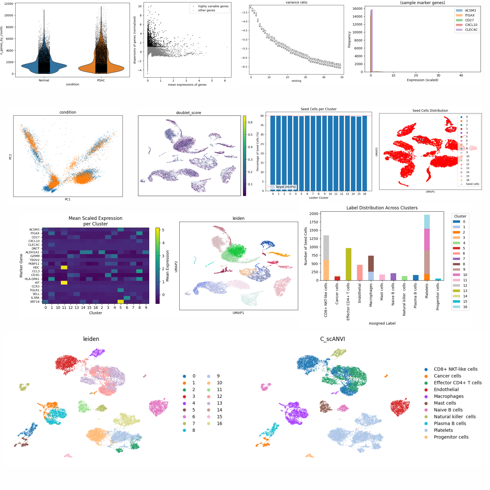

   [](https://www.celltypist.org/) 

📑 Table of Contents

- [📝 Overview](#-overview)
- [✨ Features](#-features)
- [📋 Prerequisites](#-prerequisites)
- [🚀 Installation](#-installation)
- [📁 Dataset Preparation](#-dataset-preparation)
- [🏃‍♂️ Running the Pipeline](#️-running-the-pipeline)
- [🔄 Workflow Details](#-workflow-details)
- [📊 Output Files](#-output-files)
- [📚 Citation](#-citation)
- [🤝 Acknowledgements](#-acknowledgements)


## 📝 Overview

<p align="justify"> <b>scRNA-seq-navigator</b> contains a comprehensive Jupyter notebook pipeline for single-cell RNA sequencing (scRNA-seq) data analysis. The pipeline integrates multiple state-of-the-art tools including <a href="https://scanpy.readthedocs.io/en/stable/">Scanpy</a> for preprocessing and basic analysis, <a href="https://scanpy.readthedocs.io/en/stable/">scANVI</a> for semi-supervised cell type annotation, and <a href="https://scanpy.readthedocs.io/en/stable/">CellTypist</a> for automated cell type classification. </p>

## ✨ Features

- **Complete scRNA-seq Analysis Pipeline:** From raw data to annotated clusters and differential expression analysis
- **Dual Annotation Methods:**
    - **scANVI:** Semi-supervised annotation with the [CellMarker 2.0](http://www.bio-bigdata.center/) database
    - **CellTypist:** Pre-trained models for automated annotation
- **Quality Control:** Comprehensive QC metrics and doublet detection
- **Differential Expression:** Both pseudobulk (DESeq2-ready) and cell-level DGE
- **Visualization:** UMAP, t-SNE, violin plots, and marker expression heatmaps
- **Modular Design:** Easy to adapt for different datasets and research questions

## 📋 Prerequisites

- Python 3.8 or higher
- Jupyter Notebook/Lab
- R (for optional DESeq2 pseudobulk analysis)

## 🚀 Installation

1. Clone the Repository

```bash
git clone https://github.com/usman4373/scRNA-seq-navigator-Scanpy.git
cd scRNA-seq-navigator-Scanpy
```

2. Create Conda Environment

```bash
conda create -n scrnaseq python=3.10
conda activate scrnaseq
```

3. Install Dependencies

```bash
# Install core packages
pip install scanpy anndata numpy pandas matplotlib seaborn scipy

# Install scVI/scANVI
pip install scvi-tools

# Install CellTypist
pip install celltypist

# Install scrublet for doublet detection
pip install scrublet

# Install Jupyter
pip install jupyter notebook

# Additional utilities
pip install ipywidgets scikit-learn umap-learn
```

4. Install R Dependencies (Optional, for pseudobulk DGE)

```r
install.packages("DESeq2")
install.packages("BiocManager")
BiocManager::install("DESeq2")
```

## 📁 Dataset Preparation

- Required input files:
    - `barcodes.tsv.gz`
    - `features.tsv.gz`
    - `matrix.mtx.gz`
    - `CellMarker Database` Click [here](http://www.bio-bigdata.center/CellMarker_download_files/file/Cell_marker_Seq.xlsx) to download OR navigate to [CellMarker 2.0](http://www.bio-bigdata.center/)
    - `CellTypist Models` Automatically downloaded during runtime

## 🏃‍♂️ Running the Pipeline

1. Launch Jupyter Notebook in working directory

```bash
jupyter notebook # or run: jupyter lab
```
2. Open the Notebook

- Navigate to `scRNA_scanpy.ipynb` in your browser.

3. Configure Paths

- Update the sample paths in Section 2:

```python
normal_paths = [
    "/samples/normal/sample01",
    "/samples/normal/sample02"
]

disease_paths = [
    "/samples/pdac/sample03",
    "/samples/pdac/sample04"
]
```

4. Run the Pipeline

- Execute cells sequentially. Key parameters to adjust:

- For `scANVI`

```python
# Set filtering parameters in "Load CellMarker Database" section
species = "Human"  # or "Mouse"
tissue_class = "Brain"  # Adjust for your tissue
min_markers_per_cell_type = 4
seed_frac = 0.4  # Fraction of cells for seed labeling
```

- For `CellTypist`:

```python
# Choose appropriate model
model = "Immune_All_High.pkl"  # For immune cells
```

## 🔄 Workflow Details

#### Phase 1: Data Loading & Preprocessing
- Load Data: Read `10x` Genomics format data
- Merge Samples: Combine multiple samples with proper labeling
- Quality Control:
    - Calculate QC metrics (n_genes, total_counts, mitochondrial percentage)
    - Filter cells based on QC thresholds
    - Doublet detection using `Scrublet`

#### Phase 2: Normalization & Feature Selection

- Normalization: Total count normalization and log1p transformation
- Highly Variable Features: Select top 2000 variable genes
- Scaling: Zero-center and scale expression data

#### Phase 3: Dimensionality Reduction & Clustering

- PCA: Principal component analysis on HVFs
- Neighborhood Graph: Construct k-nearest neighbor graph
- Clustering: Leiden clustering
- Visualization: UMAP and t-SNE embeddings

#### Phase 4: Cell Type Annotation

- Option A: `scANVI` (Semi-supervised)
    - **Marker Database Preparation:** Filter `CellMarker` database by species/tissue
    - **Seed Label Generation:** Random selection of seed cells per cluster
    - **Marker Scoring:** Score clusters against marker gene sets
    - **scVI Training:** Train variational autoencoder on full dataset
    - **scANVI Training:** Transfer labels from seed cells to all cells

#### NOTE:
<p align="justify"><strong>
When performing annotation with CellMarker, it is important to use tissue-specific cell types according to your datasets rather than broad cell niches. The CellMarker 2.0 database contains highly detailed, tissue-resolved marker information, and using overly broad categories may lead to incorrect cell-type annotations compared to the ground truth.
</strong></p>

- Option B: `CellTypist`
    - **Model Selection:** Choose appropriate pre-trained model
    - **Prediction:** Annotate cells using majority voting
    - **Visualization:** UMAP plots with predicted labels

#### Phase 5: Differential Expression Analysis
- Pseudobulk DGE (DESeq2-ready):
    - Aggregate counts by sample and cell type
    - Export count matrices and metadata for DESeq2
- Cell-level DGE (Scanpy):
    - Wilcoxon rank-sum test between conditions
    - Export differential expression results

## 📊 Output Files

- Intermediate Files
    - `filtered_data.h5ad` – QC-filtered data
    - `adata_normalized.h5ad` – Normalized data
    - `adata_clustered.h5ad` – Scaled and clustered data
- scvi_model/ – Trained scVI model
- Final Outputs
    - `annotated_dataset.h5ad` – Fully annotated dataset
    - `cell_annotations.csv` – Cell-level annotation table
    - `used_marker_genes.csv` – Marker genes used for annotation
    - `celltypist_*` – CellTypist prediction files
- Differential Expression Results
    - Pseudobulk count matrices for DESeq2
    - Cell-level DGE results in CSV format
 


## 📚 Citation
- If you use this pipeline/workflow in your research, please cite:

```bash
scRNA-seq-navigator-Scanpy. GitHub: https://github.com/usman4373/scRNA-seq-navigator-Scanpy
```

## 🤝 Acknowledgements
- Also cite the respective tools used in your analysis.
- Software Tools
    - `Scanpy`: [Wolf et al., Genome Biology (2018)](https://link.springer.com/article/10.1186/s13059-017-1382-0)
    - `scVI/scANVI`: [Lopez et al., Nature Methods (2018)](https://www.nature.com/articles/s41592-018-0229-2)
    - `CellTypist`: [Domínguez Conde et al., Science (2022)](https://www.science.org/doi/10.1126/science.abl5197)
    - `Scrublet`: [Wolock et al., Cell Systems (2019)](https://www.cell.com/cell-systems/fulltext/S2405-4712(18)30474-5?_returnURL=https%3A%2F%2Flinkinghub.elsevier.com%2Fretrieve%2Fpii%2FS2405471218304745%3Fshowall%3Dtrue)
- Data Resources
    - `CellMarker 2.0 Database`: [Zhang et al., Nucleic Acids Research (2019)](https://academic.oup.com/nar/article/47/D1/D721/5115823)
- Other open-source tools
---
